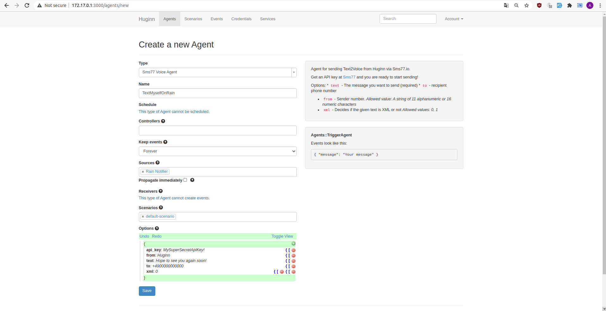

# Huginn Agent Gem for sending Text2Voice messages via Sms77.io

## Installation

Append huginn_sms77_voice_agent string to your Huginn's .env `ADDITIONAL_GEMS` key.

If this agent is the only gem used it would look like this:
```ADDITIONAL_GEMS=huginn_sms77_voice_agent```

The last step is to run ```bundle``` from a shell.

### Usage
Head to the administration configuration, enter your API key and you can start sending!

#### Screenshots
